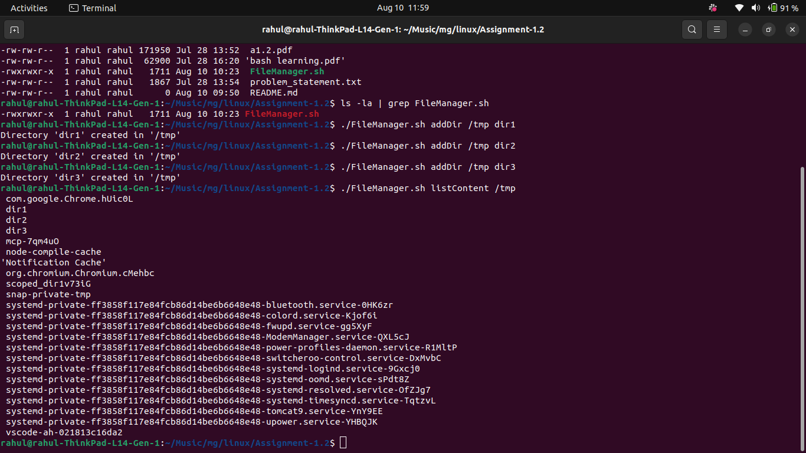
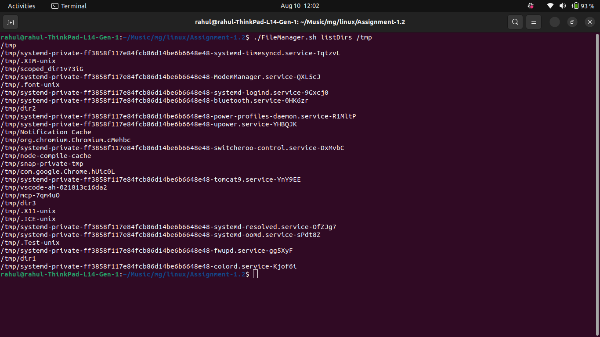
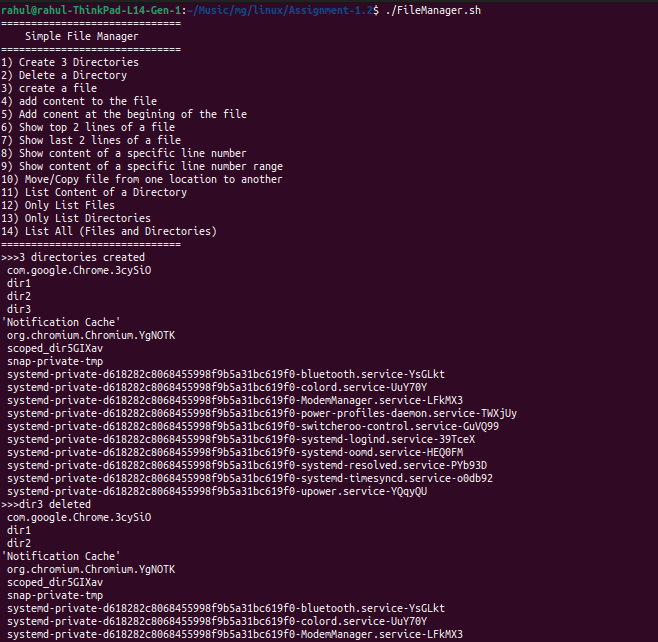
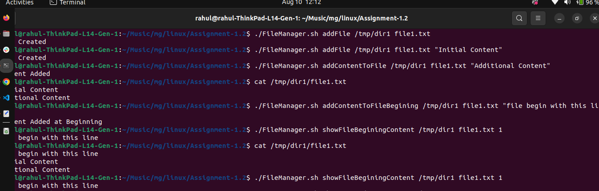
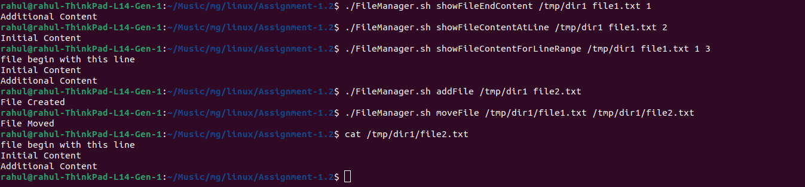
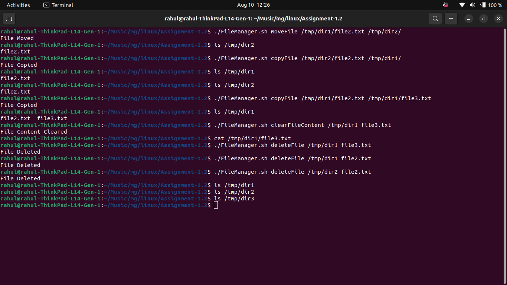

# Linux Assignment-1.2

## Objective

Create a command-line utility named `FileManager.sh` for performing basic Linux directory and file-management operations.

> **Note:** The assignment says not to use sed. This implementation does not use sed.

## How the Script Works

The script uses:

```bash
case "$1" in
```

`$1` is the first command-line argument.

For example:

```bash
./FileManager.sh addDir /tmp dir1
```

The arguments are:

```text
$1 = addDir
$2 = /tmp
$3 = dir1
```

The case statement identifies `addDir` and executes its corresponding commands.

# Directory Operations

## 1. Create a Directory

```bash
./FileManager.sh addDir /tmp dir1
./FileManager.sh addDir /tmp dir2
./FileManager.sh addDir /tmp dir3
```

Internally:

```bash
mkdir -p "$2/$3"
```

`mkdir -p` creates the directory and required parent directories.

## 2. Delete a Directory

```bash
./FileManager.sh deleteDir /tmp dir3
```

Internally:

```bash
rmdir "$2/$3"
```

`rmdir` removes an empty directory.

## 3. List Directory Contents

```bash
./FileManager.sh listContent /tmp
```

Internally:

```bash
ls "$2"
```

## 4. List Only Files

```bash
./FileManager.sh listFiles /tmp
```

Internally:

```bash
find "$2" -maxdepth 1 -type f
```

`-type f` selects regular files.

## 5. List Only Directories

```bash
./FileManager.sh listDirs /tmp
```

Internally:

```bash
find "$2" -maxdepth 1 -type d
```

`-type d` selects directories.

## 6. List All Files and Directories

```bash
./FileManager.sh listAll /tmp
```

Internally:

```bash
ls -la "$2"
```

- `-l` = long listing
- `-a` = include hidden entries

# File Operations

## 7. Create an Empty File

```bash
./FileManager.sh addFile /tmp/dir1 file1.txt
```

Internally:

```bash
touch "$2/$3"
```

## 8. Create a File With Initial Content

```bash
./FileManager.sh addFile /tmp/dir1 file1.txt "Initial Content"
```

The script creates the file and, if `$4` is provided, writes it using:

```bash
echo "$4" > "$2/$3"
```

The `>` operator overwrites existing content.

## 9. Add Content to a File

```bash
./FileManager.sh addContentToFile /tmp/dir1 file1.txt "Additional Content"
```

Internally:

```bash
echo "$4" >> "$2/$3"
```

The `>>` operator appends content without overwriting existing content.

## 10. Add Content at the Beginning

```bash
./FileManager.sh addContentToFileBegining /tmp/dir1 file1.txt "Additional Content"
```

The script uses:

```bash
echo "$4" > temp.txt
cat "$2/$3" >> temp.txt
mv temp.txt "$2/$3"
```

### How it works

1. Put the new content into `temp.txt`.
2. Append the original file content to `temp.txt`.
3. Move `temp.txt` over the original file.

This adds the content at the beginning without using sed.

## 11. Show Top N Lines

```bash
./FileManager.sh showFileBeginingContent /tmp/dir1 file1.txt 5
```

Internally:

```bash
head -n "$4" "$2/$3"
```

This displays the first 5 lines.

## 12. Show Last N Lines

```bash
./FileManager.sh showFileEndContent /tmp/dir1 file1.txt 5
```

Internally:

```bash
tail -n "$4" "$2/$3"
```

This displays the last 5 lines.

## 13. Show a Specific Line

```bash
./FileManager.sh showFileContentAtLine /tmp/dir1 file1.txt 10
```

Internally:

```bash
awk "NR==$4" "$2/$3"
```

For line 10:

```bash
awk "NR==10" /tmp/dir1/file1.txt
```

`NR` represents the current line number in awk.

## 14. Show a Line Range

```bash
./FileManager.sh showFileContentForLineRange /tmp/dir1 file1.txt 5 10
```

Internally:

```bash
awk "NR>=$4 && NR<=$5" "$2/$3"
```

This displays lines 5 through 10.

## 15. Move a File

```bash
./FileManager.sh moveFile /tmp/dir1/file1.txt /tmp/dir1/file2.txt
```

Internally:

```bash
mv "$2" "$3"
```

Another example:

```bash
./FileManager.sh moveFile /tmp/dir1/file2.txt /tmp/dir2/
```

This moves the file into `/tmp/dir2/`.

## 16. Copy a File

```bash
./FileManager.sh copyFile /tmp/dir2/file2.txt /tmp/dir1/
```

Internally:

```bash
cp "$2" "$3"
```

To copy with a different name:

```bash
./FileManager.sh copyFile /tmp/dir1/file2.txt /tmp/dir1/file3.txt
```

## 17. Clear File Content

```bash
./FileManager.sh clearFileContent /tmp/dir1 file3.txt
```

Internally:

```bash
"$2/$3"
```

This sets the file size to zero while keeping the file itself.

## 18. Delete a File

```bash
./FileManager.sh deleteFile /tmp/dir1 file2.txt
```

Internally:

```bash
rm "$2/$3"
```

# Complete Command Examples

## Directory Commands

```bash
./FileManager.sh addDir /tmp dir1
./FileManager.sh addDir /tmp dir2
./FileManager.sh addDir /tmp dir3
```

```bash
./FileManager.sh listContent /tmp
./FileManager.sh listFiles /tmp
./FileManager.sh listDirs /tmp
./FileManager.sh listAll /tmp
```

```bash
./FileManager.sh deleteDir /tmp dir3
```

## File Commands

```bash
./FileManager.sh addFile /tmp/dir1 file1.txt
./FileManager.sh addFile /tmp/dir1 file1.txt "Initial Content"
./FileManager.sh addContentToFile /tmp/dir1 file1.txt "Additional Content"
./FileManager.sh addContentToFileBegining /tmp/dir1 file1.txt "Additional Content"
```

```bash
./FileManager.sh showFileBeginingContent /tmp/dir1 file1.txt 5
./FileManager.sh showFileEndContent /tmp/dir1 file1.txt 5
./FileManager.sh showFileContentAtLine /tmp/dir1 file1.txt 10
./FileManager.sh showFileContentForLineRange /tmp/dir1 file1.txt 5 10
```

```bash
./FileManager.sh moveFile /tmp/dir1/file1.txt /tmp/dir1/file2.txt
./FileManager.sh moveFile /tmp/dir1/file2.txt /tmp/dir2/
```

```bash
./FileManager.sh copyFile /tmp/dir2/file2.txt /tmp/dir1/
./FileManager.sh copyFile /tmp/dir1/file2.txt /tmp/dir1/file3.txt
```

```bash
./FileManager.sh clearFileContent /tmp/dir1 file3.txt
./FileManager.sh deleteFile /tmp/dir1 file2.txt
```

## Screenshots









# Command Summary

| Operation | FileManager Command | Linux Command |
|---|---|---|
| Create directory | `addDir` | `mkdir` |
| Delete directory | `deleteDir` | `rmdir` |
| List content | `listContent` | `ls` |
| List files | `listFiles` | `find` |
| List directories | `listDirs` | `find` |
| List all | `listAll` | `ls -la` |
| Create file | `addFile` | `touch` |
| Add content | `addContentToFile` | `echo >>` |
| Add at beginning | `addContentToFileBegining` | `echo, cat, mv` |
| Show first N lines | `showFileBeginingContent` | `head` |
| Show last N lines | `showFileEndContent` | `tail` |
| Show specific line | `showFileContentAtLine` | `awk` |
| Show line range | `showFileContentForLineRange` | `awk` |
| Move file | `moveFile` | `mv` |
| Copy file | `copyFile` | `cp` |
| Clear file | `clearFileContent` | `>` |
| Delete file | `deleteFile` | `rm` |

# Important Bash Concepts

## Positional Parameters

Example:

```bash
./FileManager.sh addFile /tmp/dir1 file1.txt "Initial Content"
```

Values:

```text
$1 = addFile
$2 = /tmp/dir1
$3 = file1.txt
$4 = Initial Content
```

For a line-range command:

```bash
./FileManager.sh showFileContentForLineRange /tmp/dir1 file1.txt 5 10
```

Values:

```text
$1 = showFileContentForLineRange
$2 = /tmp/dir1
$3 = file1.txt
$4 = 5
$5 = 10
```

## case

Used to select an operation based on `$1`:

```bash
case "$1" in
addDir)...;;
deleteDir)...;;
esac
```

## Redirection

### Overwrite:

```bash
echo "Hello" > file.txt
```

### Append:

```bash
echo "Hello Again" >> file.txt
```

### Clear:

```bash
file.txt
```

## Pipes

Commands can pass output to another command using `|`:

```bash
cat file.txt | head -n 5
```

# Note About sed

The assignment specifically says:

> Do not use sed.

No sed command is used in this implementation.

For line operations, the script uses:

```text
head
tail
awk
```

Examples:

```bash
head -n 5 file.txt
```

```bash
tail -n 5 file.txt
```

```bash
awk "NR==10" file.txt
```

```bash
awk "NR>=5 && NR<=10" file.txt
```

# Conclusion

The updated FileManager.sh is a command-line based Linux file manager utility. It accepts an operation as the first argument and additional parameters for the directory, file, content, or line numbers.

For example:

```bash
./FileManager.sh addDir /tmp dir1
```

and:

```bash
./FileManager.sh addFile /tmp/dir1 file1.txt "Initial Content"
```

The script demonstrates practical use of Bash positional parameters, case, conditional statements, file redirection, mkdir, rmdir, ls, find, touch, echo, cat, head, tail, awk, mv, cp, and rm.