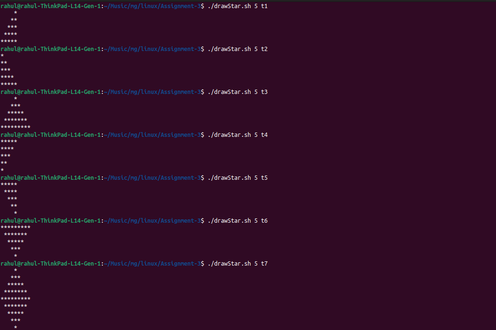
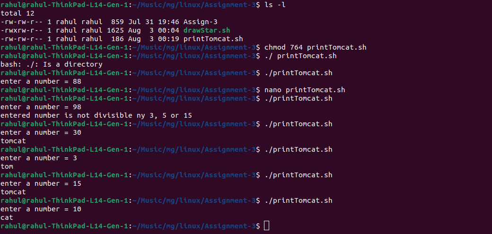

Shell Scripting Assignment — Star Patterns & Tomcat

This assignment contains two parts:

Part A: Create a shell script to generate different star (*) patterns.

Part B: Create a shell script that prints tom, cat, or tomcat based on divisibility.

Part A — Star Pattern Generator

Objective

Create a shell script named drawStar.sh that accepts two arguments:

./drawStar.sh <size> <type>

Where:

size specifies the size of the pattern.

type specifies which star pattern should be generated.

Example:

./drawStar.sh 5 t1

The script supports seven pattern types:

t1
t2
t3
t4
t5
t6
t7

How drawStar.sh Works

1. Check Number of Arguments

if [ $# -ne 2 ]; then
    echo "Usage: $0 <size> <type>"
    exit 1
fi

$# contains the number of arguments passed to the script.

The script requires exactly two arguments:

$1 → size
$2 → type

For example:

./drawStar.sh 5 t1

means:

$1 = 5
$2 = t1

If the user does not provide exactly two arguments, the script displays the usage message and exits.

2. Store Arguments in Variables

size=$1
type=$2

This makes the script easier to read.

For:

./drawStar.sh 5 t3

the variables become:

size = 5
type = t3

3. Select the Pattern Using case

case $type in

The case statement checks the value of type and executes the matching pattern.

For example:

t1)
    ...
    ;;

runs when:

type=t1

Pattern Types

T1 — Right-Aligned Triangle

Command:

./drawStar.sh 5 t1

Output:

    *
   **
  ***
 ****
*****

Logic

The first loop controls the rows:

for ((i=1;i<=size;i++))

The second loop prints spaces:

for ((j=size-i;j>=1;j--))

The third loop prints stars:

for ((k=1;k<=i;k++))

As the row number increases:

Spaces decrease.

Stars increase.

T2 — Left-Aligned Triangle

Command:

./drawStar.sh 5 t2

Output:

*
**
***
****
*****

Logic

The outer loop controls rows:

for ((i=1;i<=size;i++))

The inner loop prints i stars:

for ((j=1;j<=i;j++))

Therefore:

Row 1 → 1 star
Row 2 → 2 stars
Row 3 → 3 stars
...

T3 — Pyramid

Command:

./drawStar.sh 5 t3

Output:

    *
   ***
  *****
 *******
*********

Logic

The script first prints spaces:

for ((j=size-i;j>=1;j--))

Then it prints:

2*i-1

stars:

for ((k=1;k<=2*i-1;k++))

The number of stars becomes:

1
3
5
7
9

This creates the pyramid shape.

T4 — Inverted Left Triangle

Command:

./drawStar.sh 5 t4

Output:

*****
****
***
**
*

Logic

The outer loop starts from size and decreases:

for ((i=size;i>=1;i--))

The inner loop prints i stars.

Therefore the number of stars decreases on every row.

T5 — Inverted Right Triangle

Command:

./drawStar.sh 5 t5

Output:

*****
 ****
  ***
   **
    *

Logic

The outer loop decreases:

for ((i=size;i>=1;i--))

The first inner loop adds spaces:

for ((j=1;j<=size-i;j++))

The second inner loop prints stars:

for ((k=1;k<=i;k++))

As the rows progress:

Spaces increase.

Stars decrease.

T6 — Inverted Pyramid

Command:

./drawStar.sh 5 t6

Output:

*********
 *******
  *****
   ***
    *

Logic

The number of rows is controlled by:

for ((i=size;i>=1;i--))

The script prints:

2*i-1

stars.

The number of stars becomes:

9
7
5
3
1

At the same time, the number of leading spaces increases.

T7 — Diamond

Command:

./drawStar.sh 5 t7

Output:

    *
   ***
  *****
 *******
*********
 *******
  *****
   ***
    *

The diamond consists of two parts:

Upper pyramid

Lower inverted pyramid

Upper Pyramid

for ((i=1;i<=size;i++))

creates the upper half.

The number of stars is:

2*i-1

Lower Pyramid

for ((i=size-1;i>=1;i--))

creates the lower half.

It starts at size-1 so that the widest row is not printed twice.

Star Pattern Summary

Type

Pattern

t1

Right-aligned triangle

t2

Left-aligned triangle

t3

Pyramid

t4

Inverted left triangle

t5

Inverted right triangle

t6

Inverted pyramid

t7

Diamond

Important Concepts Used in Part A

for Loop

Used to repeat operations.

Example:

for ((i=1;i<=size;i++))
do
    ...
done

Nested Loops

The patterns use loops inside other loops.

For example:

Outer loop → controls rows
Inner loop → controls spaces/stars

printf

The script uses:

printf "*"

to print a star without automatically moving to a new line.

It uses:

echo

after each row to move to the next line.

Part B — Tom Cat / Tomcat

Objective

Create a shell script named printTomcat.sh that accepts a number and prints output based on divisibility.

Rules:

Divisible by 15 → tomcat

Divisible by 5 → cat

Divisible by 3 → tom

Otherwise → display a message indicating that the number is not divisible by 3, 5, or 15.

How printTomcat.sh Works

1. Read the Number

read -p "enter a number = " num

The read command takes input from the user and stores it in the variable num.

Example:

enter a number = 30

Then:

num = 30

2. Check Divisibility by 15

if (( num % 15 == 0 )); then
    echo "tomcat"

The % operator returns the remainder.

For example:

30 % 15 = 0

Therefore, 30 is divisible by 15 and the script prints:

tomcat

3. Check Divisibility by 5

elif (( num % 5 == 0 )); then
    echo "cat"

For example:

10 % 5 = 0

Therefore:

cat

4. Check Divisibility by 3

elif (( num % 3 == 0 )); then
    echo "tom"

For example:

6 % 3 = 0

Therefore:

tom

5. If None of the Conditions Match

else
    echo "entered number is not divisible ny 3, 5 or 15"
fi

For example:

7

7 is not divisible by 3, 5, or 15, so the else block executes.

Note: The original script contains the typo ny. A cleaner message would be by 3, 5 or 15.

Example Outputs

Input: 7

./printTomcat.sh

Input:

enter a number = 7

Output:

entered number is not divisible ny 3, 5 or 15

Input: 6

enter a number = 6

Output:

tom

Because:

6 % 3 = 0

Input: 10

enter a number = 10

Output:

cat

Because:

10 % 5 = 0

Input: 30

enter a number = 30

Output:

tomcat

Because:

30 % 15 = 0

Why the 15 Condition Comes First

The order of the conditions is important.

The script checks:

if (( num % 15 == 0 ))

before:

elif (( num % 5 == 0 ))

and:

elif (( num % 3 == 0 ))

This is necessary because every number divisible by 15 is also divisible by both 3 and 5.

For example:

30 % 15 = 0
30 % 5  = 0
30 % 3  = 0

If the script checked divisibility by 3 first, 30 would produce:

tom

instead of:

tomcat

Therefore, the most specific condition is checked first.

Part B Logic

             Number
                |
                v
        Divisible by 15?
           /        \
         Yes         No
          |           |
       tomcat    Divisible by 5?
                    /       \
                  Yes        No
                   |          |
                  cat    Divisible by 3?
                              /      \
                            Yes       No
                             |         |
                            tom       Message

Commands and Concepts Used

Concept

Used In

Bash script

Both

Command-line arguments

drawStar.sh

Positional parameters $1, $2

drawStar.sh

$#

drawStar.sh

case statement

drawStar.sh

for loop

drawStar.sh

Nested loops

drawStar.sh

printf

drawStar.sh

echo

Both

read

printTomcat.sh

if / elif / else

printTomcat.sh

Arithmetic evaluation (( ))

printTomcat.sh

Modulo %

printTomcat.sh

Running the Scripts

First make the scripts executable:

chmod +x drawStar.sh
chmod +x printTomcat.sh

Then run Part A:

./drawStar.sh 5 t1

or:

./drawStar.sh 5 t7

Run Part B:

./printTomcat.sh

Then enter a number when prompted.

Conclusion

This assignment provides practical experience with Bash scripting, loops, conditional statements, arithmetic operations, command-line arguments, and pattern generation.

Part A

drawStar.sh demonstrates:

Positional parameters

Argument validation

case statements

Nested for loops

Printing spaces and stars

Generating seven different patterns

Part B

printTomcat.sh demonstrates:

User input with read

Arithmetic evaluation

Modulo operator %

if, elif, and else

Checking multiple divisibility conditions

Together, both scripts provide a practical introduction to basic Bash programming concepts.