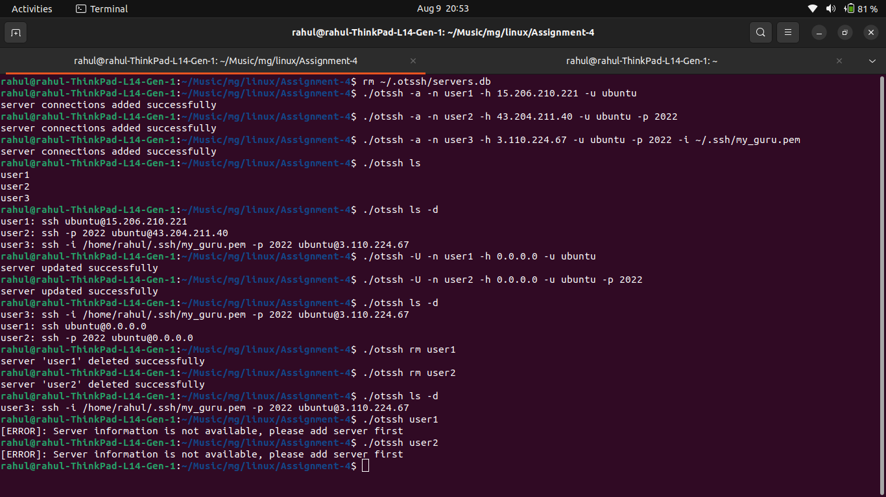
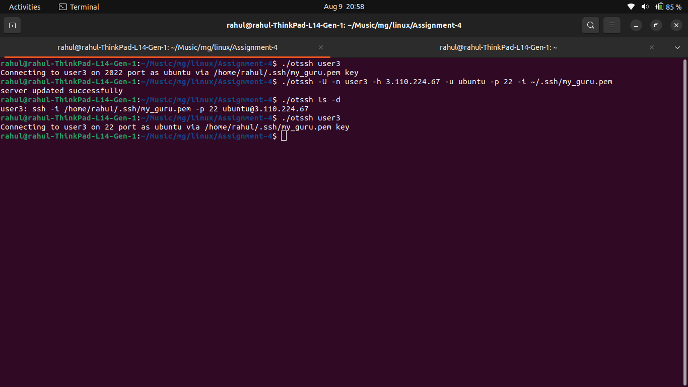
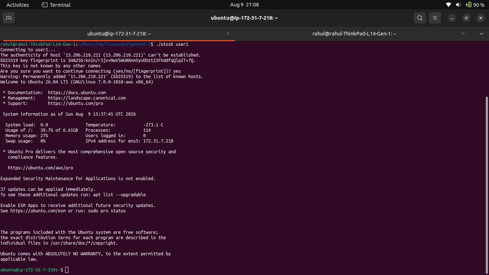

# otssh — SSH Connection Manager

## Assignment — SSH Connection Utility

## Objective

Create a command-line utility named `otssh` that manages SSH connection details.

The utility should provide the following features:

- Add an SSH connection
- List SSH connections
- List SSH connections with details
- Update an SSH connection
- Delete an SSH connection
- Connect to a saved SSH server

The utility stores SSH connection information locally so that the user can connect to a server using only its saved connection name.

# Features

The `otssh` utility supports:

- Add SSH connection
- List SSH connections
- List SSH connections with details
- Update SSH connection
- Delete SSH connection
- Connect to saved server

# Database Location

The script stores connection information in:

```bash
$HOME/.otssh/servers.db
```

At startup, the script creates the directory and database file if they do not already exist:

```bash
DB="$HOME/.otssh/servers.db"

mkdir -p "$HOME/.otssh"
touch "$DB"
```

The database uses the following pipe-separated format:

```text
name|host|user|port|key
```

Example:

```text
server1|192.168.21.30|kirti|22|
server2|192.168.42.34|kirti|2022|
server3|192.168.46.34|ubuntu|2022|/home/user/.ssh/server3.pem
```

# How the Script Works

## 1. Create the Database

The script defines the database location:

```bash
DB="$HOME/.otssh/servers.db"
```

It then creates the directory:

```bash
mkdir -p "$HOME/.otssh"
```

and creates the database file if necessary:

```bash
touch "$DB"
```

This means the user does not need to manually create the database.

## 2. Add SSH Connection

The `-a` option is used to add a connection.

### Add Server With Default SSH Port

```bash
./otssh -a -n server1 -h 192.168.21.30 -u kirti
```

The default port is:

```text
22
```

The script initializes:

```bash
port="22"
key=""
```

The stored record becomes:

```text
server1|192.168.21.30|kirti|22|
```

### Add Server With Custom Port

```bash
./otssh -a -n server2 -h 192.168.42.34 -u kirti -p 2022
```

The stored information becomes:

```text
server2|192.168.42.34|kirti|2022|
```

### Add Server With SSH Key

```bash
./otssh -a -n server3 -h 192.168.46.34 -u ubuntu -p 2022 -i ~/.ssh/server3.pem
```

The stored information contains:

```text
server3|192.168.46.34|ubuntu|2022|/home/user/.ssh/server3.pem
```

The script uses:

```bash
key=$(eval echo "$2")
```

to expand the `~` path.

### Add Command Argument Processing

After detecting `-a`, the script removes the first argument:

```bash
shift
```

It then processes the remaining arguments using a while loop:

```bash
while [ $# -gt 0 ]
do
case "$1" in
-n) name="$2"; shift 2 ;;
-h) host="$2"; shift 2 ;;
-u) user="$2"; shift 2 ;;
-p) port="$2"; shift 2 ;;
-i) key=$(eval echo "$2"); shift 2 ;;
esac
done
```

The options are:

| Option | Meaning |
|---|---|
| `-n` | Connection name |
| `-h` | Server hostname/IP |
| `-u` | SSH username |
| `-p` | SSH port |
| `-i` | SSH private key |

## 3. List SSH Connections

### List Names Only

Command:

```bash
./otssh ls
```

The script uses:

```bash
cut -d'|' -f1 "$DB"
```

The database uses `|` as the delimiter.

Therefore:

```text
server1|192.168.21.30|kirti|22|
server2|192.168.42.34|kirti|2022|
server3|192.168.46.34|ubuntu|2022|/home/user/.ssh/server3.pem
```

produces:

```text
server1
server2
server3
```

## 4. List SSH Connections With Details

Command:

```bash
./otssh ls -d
```

The script reads every database record:

```bash
while IFS="|" read -r name host user port key
do
...
done < "$DB"
```

The `IFS="|"` tells Bash to split each line using `|`.

### Default Port

If the port is 22, the script displays:

```text
server1: ssh kirti@192.168.21.30
```

The command is built using:

```bash
echo "$name: ssh $user@$host"
```

### Custom Port

For a custom port:

```text
server2: ssh -p 2022 kirti@192.168.42.34
```

The script uses:

```bash
echo "$name: ssh -p $port $user@$host"
```

### SSH Key

If an SSH key is configured:

```text
server3: ssh -i /home/user/.ssh/server3.pem -p 2022 ubuntu@192.168.46.34
```

The script uses:

```bash
echo "$name: ssh -i $key -p $port $user@$host"
```

## 5. Update an SSH Connection

The script uses `-U` for updating a connection.

Example:

```bash
./otssh -U -n server1 -h server1 -u user1
```

Another example:

```bash
./otssh -U -n server2 -h server2 -u user2 -p 2022
```

The script first checks whether the server exists:

```bash
if grep -q "^$name|" "$DB"; then
```

If found, it creates a temporary database:

```bash
tmpfile="$HOME/.otssh/temp.db"
```

Then removes the old record:

```bash
grep -v "^$name|" "$DB" > "$tmpfile"
```

The updated record is appended:

```bash
echo "$name|$host|$user|$port|$key" >> "$tmpfile"
```

Finally, the temporary database replaces the original:

```bash
mv "$tmpfile" "$DB"
```

## 6. Delete an SSH Connection

Command:

```bash
./otssh rm server1
```

The script checks whether the server exists:

```bash
grep -q "^$2|" "$DB"
```

If found, it removes the matching record:

```bash
grep -v "^$2|" "$DB" > "$tmpfile"
```

Then the temporary database replaces the original:

```bash
mv "$tmpfile" "$DB"
```

## 7. Connect to a Saved Server

The connection name itself can be passed to `otssh`.

Example:

```bash
./otssh server3
```

The script searches the database:

```bash
line=$(grep "^$server|" "$DB")
```

If the server does not exist:

```text
[ERROR]: Server information is not available, please add server first
```

If it exists, the record is split:

```bash
IFS="|" read -r name host user port key <<< "$line"
```

The variables become:

```text
name
host
user
port
key
```

### Building the SSH Command

The default SSH command is:

```bash
cmd="ssh -p $port $user@$host"
```

If a key is available:

```bash
[ -n "$key" ] && cmd="ssh -i $key -p $port $user@$host"
```

Finally:

```bash
exec $cmd
```

executes the actual SSH command and opens the live SSH connection.

# Complete Usage Examples

## Add Connections

```bash
./otssh -a -n server1 -h 192.168.21.30 -u kirti
```

```bash
./otssh -a -n server2 -h 192.168.42.34 -u kirti -p 2022
```

```bash
./otssh -a -n server3 -h 192.168.46.34 -u ubuntu -p 2022 -i ~/.ssh/server3.pem
```

## List Connections

```bash
./otssh ls
```

Example:

```text
server1
server2
server3
```

## List Connections With Details

```bash
./otssh ls -d
```

Example:

```text
server1: ssh kirti@192.168.21.30
server2: ssh -p 2022 kirti@192.168.42.34
server3: ssh -i /home/user/.ssh/server3.pem -p 2022 ubuntu@192.168.46.34
```

## Update Connection

```bash
./otssh -U -n server1 -h server1 -u user1
```

```bash
./otssh -U -n server2 -h server2 -u user2 -p 2022
```

Then:

```bash
./otssh ls -d
```

## Delete Connection

```bash
./otssh rm server1
```

Then:

```bash
./otssh ls -d
```

## Connect

```bash
./otssh server3
```

The utility retrieves the saved details and executes the corresponding SSH command.

# Example Database

After adding three servers, the database may look like:

```text
server1|192.168.21.30|kirti|22|
server2|192.168.42.34|kirti|2022|
server3|192.168.46.34|ubuntu|2022|/home/user/.ssh/server3.pem
```

The database is located at:

```text
~/.otssh/servers.db
```

# Command Summary

| Operation | Command | Linux Concepts |
|---|---|---|
| Add connection | `otssh -a ...` | echo, file append |
| List names | `otssh ls` | cut |
| List details | `otssh ls -d` | while, read, IFS |
| Update connection | `otssh -U ...` | grep, temporary file |
| Delete connection | `otssh rm NAME` | grep, temporary file |
| Connect | `otssh NAME` | grep, read, ssh, exec |

# Bash Concepts Used

## Positional Parameters

Example:

```bash
./otssh -a -n server1 -h 192.168.21.30 -u kirti
```

Initially:

```text
$1 = -a
$2 = -n
$3 = server1
$4 = -h
$5 = 192.168.21.30
$6 = -u
$7 = kirti
```

The script uses `shift` to process the options.

## case

The main script uses:

```bash
case "$1" in
```

to select the operation.

The supported operations are:

```text
-a
-U
ls
rm
server name
```

## while

The add and update operations process multiple command-line options using:

```bash
while [ $# -gt 0 ]
do
...
done
```

## shift

Example:

```bash
shift
```

removes the first positional argument.

```bash
shift 2
```

removes the first two arguments.

This allows the script to process options such as:

```text
-n server1
-h 192.168.21.30
-u kirti
-p 2022
-i ~/.ssh/server3.pem
```

## grep

The script uses grep to search for a saved connection:

```bash
grep "^$server|" "$DB"
```

It also checks whether a connection exists:

```bash
grep -q "^$name|" "$DB"
```

And removes a matching record using:

```bash
grep -v "^$name|" "$DB"
```

## cut

Used to extract the connection name:

```bash
cut -d'|' -f1 "$DB"
```

Here:

```text
-d'|' → pipe is the delimiter
-f1   → select the first field
```

## IFS

The script uses:

```bash
IFS="|" read -r name host user port key
```

This splits a database record into separate variables.

For example:

```text
server3|192.168.46.34|ubuntu|2022|/home/user/.ssh/server3.pem
```

becomes:

```text
name = server3
host = 192.168.46.34
user = ubuntu
port = 2022
key  = /home/user/.ssh/server3.pem
```

## exec

The actual SSH connection is opened using:

```bash
exec $cmd
```

This replaces the current shell process with the SSH process.

## Screenshots





# Conclusion

The otssh utility provides a simple way to save and manage SSH connection information.

Instead of remembering the complete SSH command every time, the user can save the connection:

```bash
./otssh -a -n server3 -h 192.168.46.34 -u ubuntu -p 2022 -i ~/.ssh/server3.pem
```

and later connect using only:

```bash
./otssh server3
```

The utility demonstrates practical Bash scripting concepts including:

- Command-line argument processing
- case
- while
- shift
- grep
- cut
- read
- IFS
- Temporary files
- File redirection
- SSH command construction
- exec

Local data storage