# Process Management Utilities & Linux Kernel Experiments

This assignment contains three parts:

Part A: Create a process management utility (`otProcessManager`) to inspect, track, and terminate system processes based on memory usage, CPU usage, process priority, duration, and execution state.

Part B: Create a service daemon process manager (`ProcessManager.sh`) that registers, starts, checks status, stops, changes priority, and lists background services as daemons.

Part C: Perform hands-on Linux system experiments to observe file handles, process behavior when clearing or deleting active log files, and CPU scheduling priority elevation.

---

# Part A — Process Management Utility (`otProcessManager`)

## Objective

Create a command-line process management utility named `otProcessManager` that performs real-time inspection and management of system processes.

## Syntax

```bash
./otProcessManager <subcommand> [arguments]
```

## Supported Commands

| Operation | Command | Main Linux Tool / Logic |
|---|---|---|
| Top Processes by Memory | `./otProcessManager topProcess <N> memory` | `ps -eo pid,comm,%mem --sort=-%mem` |
| Top Processes by CPU | `./otProcessManager topProcess <N> cpu` | `ps -eo pid,comm,%cpu --sort=-%cpu` |
| Kill Least Priority Process | `./otProcessManager killLeastPriorityProcess` | `ps -eo pid,ni --sort=-ni \| awk` + `kill` |
| Running Duration of Process | `./otProcessManager RunningDurationProcess <name/PID>` | `ps -eo pid,comm,etime \| grep` |
| List Orphan Processes | `./otProcessManager listOrphanProcess` | `ps -eo pid,ppid... \| awk '$2 == 1'` |
| List Zombie Processes | `./otProcessManager listZoombieProcess` | `ps -eo pid,ppid,stat... \| awk '$3 ~ /^Z/'` |
| Kill Process by Name/PID | `./otProcessManager killProcess <name/PID>` | `kill` (if PID) or `pkill -x` (if name) |
| List Waiting Processes | `./otProcessManager ListWaitingProcess` | `ps -eo pid,stat,wchan... \| awk '$2 ~ /^D/'` |

---

# How `otProcessManager` Works

## 1. Top N Processes by Memory or CPU

### Command:
```bash
./otProcessManager topProcess 5 memory
./otProcessManager topProcess 10 cpu
```

### Implementation:
```bash
if [ "$type" = "memory" ]; then
    ps -eo pid,comm,%mem --sort=-%mem | head -n $((n+1))
elif [ "$type" = "cpu" ]; then
    ps -eo pid,comm,%cpu --sort=-%cpu | head -n $((n+1))
fi
```

### Explanation:
- `ps -eo pid,comm,%mem`: Outputs only process ID (`pid`), command name (`comm`), and memory percentage (`%mem`).
- `--sort=-%mem`: Sorts the output in descending order (highest memory usage first).
- `head -n $((n+1))`: Displays the top $N$ processes plus $1$ extra line to preserve the table header.

---

## 2. Kill Process Having Least Priority

### Command:
```bash
./otProcessManager killLeastPriorityProcess
```

### Implementation:
```bash
pid=$(ps -eo pid,ni --sort=-ni | awk 'NR==2 {print $1}')

if [ -n "$pid" ]; then
    echo "Killing PID: $pid"
    kill "$pid"
else
    echo "No process found"
fi
```

### Explanation:
- In Linux, process priority is represented by the "nice" value (`ni`), ranging from -20 (highest priority) to 19 (lowest priority).
- `ps -eo pid,ni --sort=-ni`: Sorts processes by nice value in descending order, placing the process with the highest nice value (least CPU priority) at the top.
- `awk 'NR==2 {print $1}'`: Extracts the PID from line 2 (skipping line 1 header).
- `kill "$pid"`: Sends standard `SIGTERM` signal to terminate the identified least-priority process.

---

## 3. Running Duration of a Process

### Command:
```bash
./otProcessManager RunningDurationProcess bash
./otProcessManager RunningDurationProcess 1234
```

### Implementation:
```bash
ps -eo pid,comm,etime | grep -w "$2"
```

### Explanation:
- `etime`: Displays elapsed execution time since process startup (in `MM:SS` or `DD-HH:MM:SS` format).
- `grep -w "$2"`: Performs an exact word match on the supplied process name or PID to prevent partial string matches.

---

## 4. List Orphan Processes

### Command:
```bash
./otProcessManager listOrphanProcess
```

### Implementation:
```bash
ps -eo pid,ppid,stat,comm | awk '$2 == 1'
```

### Explanation:
- An **Orphan Process** is a running process whose parent process has terminated.
- In Linux, orphaned processes are automatically adopted by the root system initializer (`init` or `systemd`), which always holds **`PPID = 1`**.
- `awk '$2 == 1'` filters output lines where column 2 (Parent PID) equals `1`.

---

## 5. List Zombie Processes

### Command:
```bash
./otProcessManager listZoombieProcess
```

### Implementation:
```bash
ps -eo pid,ppid,stat,comm | awk '$3 ~ /^Z/'
```

### Explanation:
- A **Zombie Process** (defunct process) has completed execution, but its exit status has not yet been read by its parent process.
- `awk '$3 ~ /^Z/'` filters column 3 (Process State `STAT`) for status codes starting with **`Z`**.

---

## 6. Kill Process by Name or PID

### Command:
```bash
./otProcessManager killProcess 12345
./otProcessManager killProcess sleep
```

### Implementation:
```bash
if [[ "$2" =~ ^[0-9]+$ ]]; then
    kill "$2"
else
    pkill -x "$2"
fi
```

### Explanation:
- `[[ "$2" =~ ^[0-9]+$ ]]`: Uses regular expressions to check if argument `$2` consists purely of numeric digits.
- If numeric, it invokes `kill "$2"` against that exact Process ID.
- If string text, it invokes `pkill -x "$2"` for exact match process name termination.

---

## 7. List Waiting Processes

### Command:
```bash
./otProcessManager ListWaitingProcess
```

### Implementation:
```bash
ps -eo pid,stat,wchan,comm | awk '$2 ~ /^D/'
```

### Explanation:
- A **Waiting Process** is in an **Uninterruptible Sleep state** (`D`), typically blocked waiting for hardware or disk I/O operations.
- `wchan`: Displays the name of the kernel function where the process is currently sleeping.
- `awk '$2 ~ /^D/'` filters column 2 (`STAT`) for state code starting with **`D`**.

---

## Screenshots

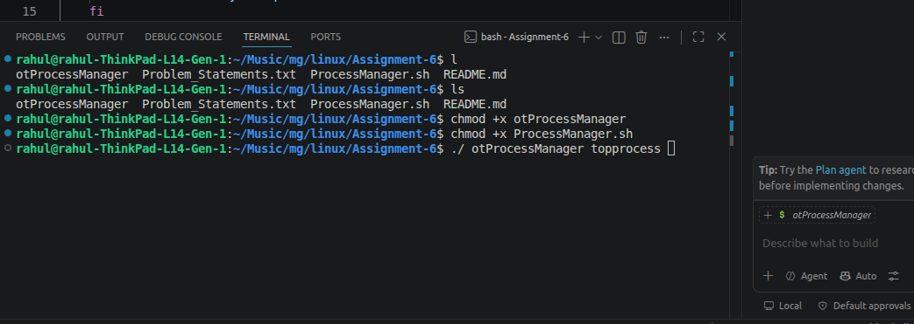
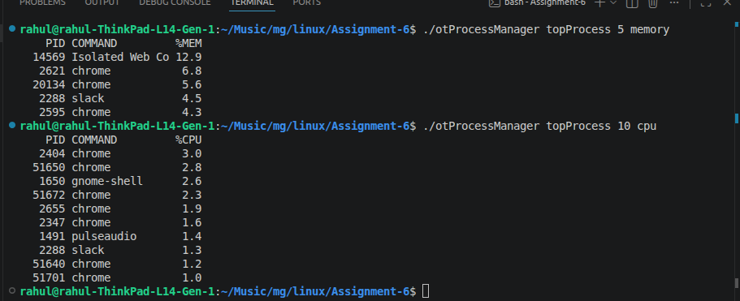
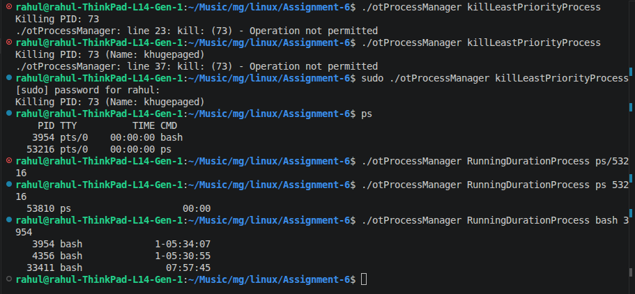
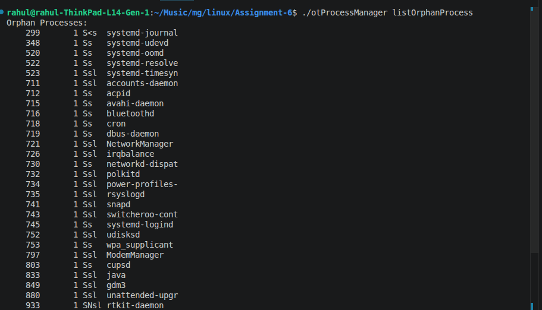
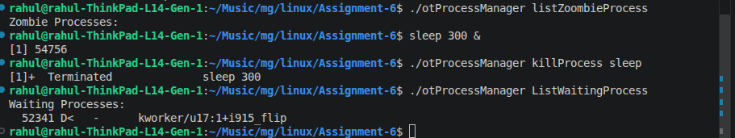

# Part B — Service Daemon Manager (`ProcessManager.sh`)

## Objective

Create a service management utility named `ProcessManager.sh` that manages long-running scripts as system daemon processes using option flags (`getopts`).

## Syntax

```bash
./ProcessManager.sh -o <operation> [-s <script_path>] [-a <alias>] [-p <low/med/high>]
```

## Operation Summary Table

| Operation | Flag Command | Key Function / Linux Mechanism |
|---|---|---|
| Register Service | `./ProcessManager.sh -o register -s <path> -a <alias>` | Append entry to `~/.processmanager/registry.txt` |
| Start Service | `./ProcessManager.sh -o start -a <alias>` | Launch script via `nohup ... &` and record PID file |
| Check Status | `./ProcessManager.sh -o status -a <alias>` | Validate PID file with `kill -0 <PID>` |
| Kill Service | `./ProcessManager.sh -o kill -a <alias>` | Terminate via `kill -9 <PID>` and clear PID file |
| Change Priority | `./ProcessManager.sh -o priority -p <level> -a <alias>` | Adjust nice priority via `renice` and update registry |
| List Services | `./ProcessManager.sh -o list` | Parse aliases from `registry.txt` via `cut` |
| View Top Status | `./ProcessManager.sh -o top [-a <alias>]` | Format table view of PID, State, Priority, and Path |

---

# How `ProcessManager.sh` Works

## 1. The Target Script (`dummy_service.sh`)
To test daemon management operations, a dummy service script (`dummy_service.sh`) is used as a background worker process.

### `dummy_service.sh` Code:
```bash
#!/bin/bash
#!/bin/bash
while true; do sleep 5; done
```

This script runs an infinite loop that sleeps for 5 seconds in each iteration, keeping the background process active without consuming CPU or generating log files.

---

## 2. Registry & Lockfile Directory
The utility maintains persistent state across shell sessions by storing configuration in a hidden directory inside the user's home path:
- Registry Path: `~/.processmanager/registry.txt` (format: `alias|script_path|priority`)
- Service Lockfiles: `~/.processmanager/<alias>.pid`

---

## 3. Register Service
- Appends `<alias>|<path>|med` to `registry.txt` after verifying the alias does not already exist.

---

## 4. Start Service
- Reads path from `registry.txt` and executes:
  ```bash
  nohup bash "$path" >/dev/null 2>&1 &
  ```
- Captures the background job PID (`$!`) and writes it to `~/.processmanager/<alias>.pid`.

---

## 5. Check Status
- Reads saved PID from `~/.processmanager/<alias>.pid` and tests kernel presence:
  ```bash
  kill -0 "$pid" 2>/dev/null
  ```
- Signal `0` checks process existence without sending an actual termination signal.

---

## 6. Change Priority
- Maps human-readable levels to Linux nice values:
  - `low` -> Nice `15`
  - `med` -> Nice `0`
  - `high` -> Nice `-10`
- Updates active process priority using `renice "$nice_val" -p "$pid"` and updates `registry.txt` using `sed`.

---

## 🧪 End-to-End Example Using `dummy_service.sh`

```bash
# 1. Make the dummy script executable
chmod +x dummy_service.sh

# 2. Register dummy_service.sh under the alias "service1"
./ProcessManager.sh -o register -s ./dummy_service.sh -a service1

# 3. Start dummy_service as a background daemon
./ProcessManager.sh -o start -a service1

# 4. Verify background execution and status
./ProcessManager.sh -o status -a service1
./ProcessManager.sh -o top

# 5. Elevate priority of dummy_service to high
./ProcessManager.sh -o priority -p high -a service1

# 6. Stop/Kill the running dummy service
./ProcessManager.sh -o kill -a service1
```

---

## Screenshots

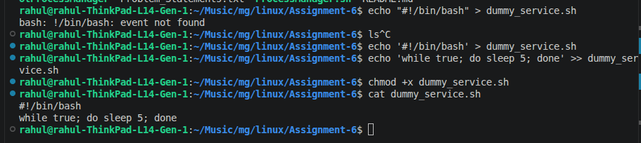
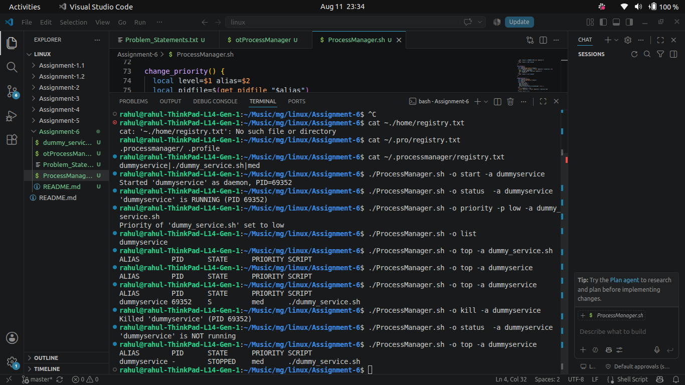

# Part C — Process File Descriptors & Priority Experiments

## Objective

Investigate Linux kernel process behavior when interacting with active open file handles, file deletion, and CPU scheduling priority elevation.

---

## Background Logger Setup

Execute the background logger directly in the terminal to redirect output to File Descriptor 3 (`FD 3`):

```bash
exec 3>> /tmp/test.log
while true; do echo "$(date): running" >&3; sleep 1; done &
echo "PID: $!"
```

### Explanation:
- `exec 3>> /tmp/test.log`: Opens custom File Descriptor 3 pointing to `/tmp/test.log` in append mode.
- `>&3`: Redirects output inside the infinite loop directly to FD 3.
- `&`: Runs the infinite loop as a background job.
- `$!`: Captures and prints the background job Process ID.

---

## Experiment 1: Clear a Log File of a Running Process

### Command:
```bash
> /tmp/test.log
```

### Observation & Analysis:
- **Observation:** File size drops instantly to 0 bytes, and new log timestamps continue accumulating.
- **Kernel Explanation:** The `>` truncation operator empties file content on disk. Because the open file descriptor (`FD 3`) held by the running process remains active, the process continues appending logs without crashing or requiring a restart.

---

## Experiment 2: Delete a Log File of a Running Process

### Commands:
```bash
rm /tmp/test.log
ls -l /tmp/test.log
lsof | grep "test.log"
```

### Observation & Analysis:
- **Observation:** `ls` returns `No such file or directory`, yet the background logger process continues running. `lsof` lists the file with tag `/tmp/test.log (deleted)`.
- **Kernel Explanation:** In Linux, `rm` removes the directory entry (dentry link) rather than the underlying data blocks. As long as a running process retains an active open file handle to the inode, the kernel preserves the file on disk. Disk space is only reclaimed after the process terminates.

---

## Experiment 3: Elevate Process Priority

### Commands:
```bash
PID=$(pgrep -f "test.log")
sudo renice -n -10 -p $PID
ps -o pid,ni,comm -p $PID
```

### Observation & Analysis:
- **Observation:** The process's nice value (`NI`) changes from `0` to `-10`.
- **Kernel Explanation:** Lower nice values correspond to higher CPU scheduling priority. Elevating priority (negative nice values) requires superuser (`sudo`) privileges to prevent non-privileged processes from monopolizing CPU resources.

---

## Screenshots

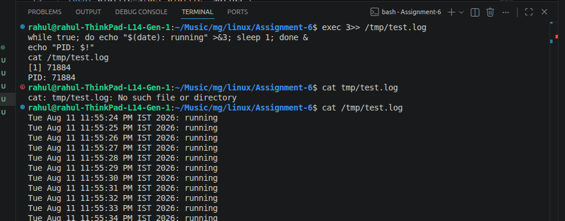
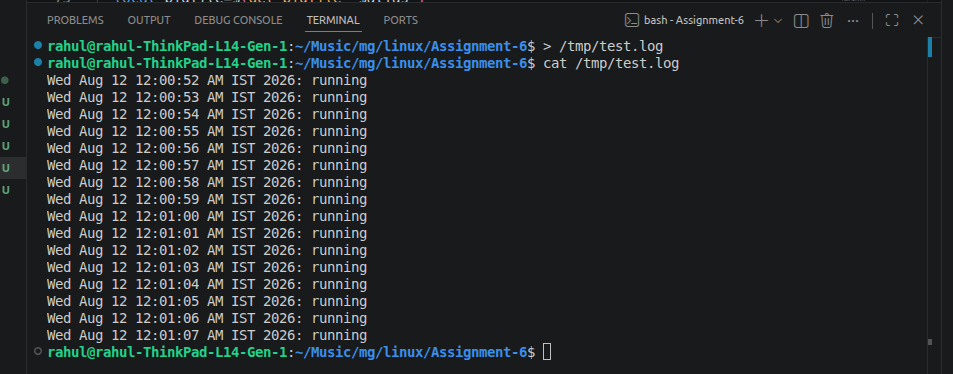
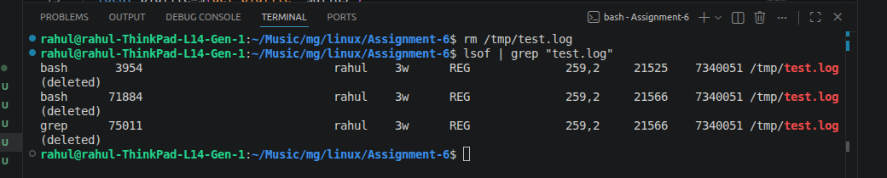
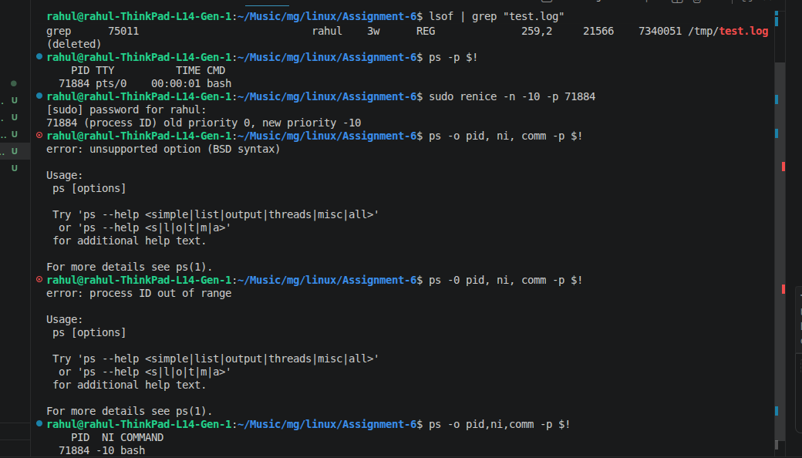
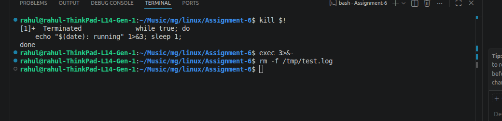

# Important Bash Concepts Demonstrated

## 1. Positional Parameters & Argument Parsing
- Part A uses `$1`, `$2`, `$3` positional parameters for command invocation.
- Part B uses `getopts "o:s:a:p:" opt` to parse option flags (`-o`, `-s`, `-a`, `-p`).

## 2. Process Identification & Signals
- `kill -0 <PID>`: Existence check without sending termination signals.
- `kill -9 <PID>`: Immediate forced termination (`SIGKILL`).
- `pkill -x <name>`: Exact-match process termination by command name.

## 3. Redirection & File Descriptors
- `nohup ... >/dev/null 2>&1 &`: Detaches process execution from controlling terminal.
- `exec 3>> /tmp/test.log`: Opens custom file descriptor 3 for append logging.

---

# Running the Utilities

Grant execution permissions to both scripts:

```bash
chmod +x otProcessManager
chmod +x ProcessManager.sh
```

### Run Part A Utilities:
```bash
./otProcessManager topProcess 5 memory
./otProcessManager listOrphanProcess
```

### Run Part B Service Manager:
```bash
./ProcessManager.sh -o register -s ./dummy_service.sh -a service1
./ProcessManager.sh -o start -a service1
./ProcessManager.sh -o status -a service1
```

---

# Conclusion

This assignment provides practical hands-on experience in Linux system administration and Bash utility development:
1. **`otProcessManager`** demonstrates system inspection, process sorting, state filtering (`STAT`), and process signals.
2. **`ProcessManager.sh`** demonstrates persistent process tracking, daemon management, lockfile handling, and `getopts` flag parsing.
3. **Part C Experiments** illustrate Linux kernel storage mechanisms, open file descriptors, inode retention upon deletion, and CPU scheduling priority.