# Maven Build Automation & Quality Assurance Pipeline

This repository contains a automated build and analysis pipeline for the **Spring3HibernateApp** Java application. The project incorporates a custom Bash automation script (`buildMaven.sh`), Java 8 compilation standards, static code analysis tools (Checkstyle, PMD, FindBugs), unit test execution with JaCoCo code coverage reporting, and automated web deployment via Apache Tomcat.

---

# Table of Contents

1. [Project Overview](#project-overview)
2. [Prerequisites & Environment](#prerequisites--environment)
3. [Project Setup & Initial Steps](#project-setup--initial-steps)
4. [Pom.xml Configuration & Build Setup](#pomxml-configuration--build-setup)
5. [The Build Automation Script (`buildMaven.sh`)](#the-build-automation-script-buildmavensh)
6. [Supported Commands & Usage](#supported-commands--usage)
7. [Detailed Breakdown of Workflow Operations](#detailed-breakdown-of-workflow-operations)
   - [Packaging (`-a`)](#1-packaging-the-application--a)
   - [Local Repository Installation (`-i`)](#2-installing-to-local-repository--i)
   - [Static Code Analysis (`-s`)](#3-static-code-analysis--s)
   - [Unit Testing & Code Coverage (`-t`)](#4-unit-testing--code-coverage--t)
   - [Tomcat Application Deployment (`-d`)](#5-application-deployment--d)
8. [Troubleshooting & Key Fixes](#troubleshooting--key-fixes)
9. [Optional Enhancements & Quality Gates](#optional-enhancements--quality-gates)
10. [Summary & Verification Checklist](#summary--verification-checklist)

---

# Project Overview

The core goal of this task is to modernize the legacy Maven build workflow for `Spring3HibernateApp`, transition to Java 8, automate common development tasks via a unified shell script (`buildMaven.sh`), enforce code quality checks, and enable seamless deployment to an embedded Tomcat server.

### Key Milestones Completed:
- **Repository Setup**: Cloned source code repository and configured build tooling.
- **Java 8 Modernization**: Updated Maven Compiler Plugin source and target compatibility to Java 1.8.
- **Static Analysis**: Integrated Checkstyle, PMD, and FindBugs.
- **Test Coverage**: Replaced deprecated Cobertura with modern JaCoCo code coverage plugin.
- **Automation CLI**: Developed a robust Bash script (`buildMaven.sh`) using `getopts` for flag parsing.
- **Issue Resolution**: Resolved OWASP dependency check network/NVD API deprecation failures.
- **Deployment**: Configured automated deployment using embedded Apache Tomcat plugin on port 11011.

---

# Prerequisites & Environment

Before building and executing this project, ensure your environment satisfies the following requirements:

- **Java Development Kit (JDK)**: Java 8 (JDK 1.8)
- **Build Tool**: Apache Maven 3.x
- **Operating System**: Linux / macOS / WSL (Windows Subsystem for Linux)
- **Shell**: Bash 4.0+
- **Version Control**: Git

Verify installation:
```bash
java -version   # Should report 1.8.x
mvn -version    # Should report Maven 3.x
bash --version  # Standard bash environment
```

---

# Project Setup & Initial Steps

## Step 0: Clone the Repository

Clone the application source code into your working workspace:

```bash
git clone https://github.com/opstree/spring3hibernate.git
cd spring3hibernate
```

---

# Pom.xml Configuration & Build Setup

To enable static analysis, code coverage, Java 8 compilation, and local server deployment, the `pom.xml` was updated with the following core configurations:

### 1. Java 8 Compiler Target
```xml
<plugin>
    <artifactId>maven-compiler-plugin</artifactId>
    <version>3.8.1</version>
    <configuration>
        <source>1.8</source>
        <target>1.8</target>
    </configuration>
</plugin>
```

### 2. PMD Static Analysis Plugin
```xml
<plugin>
    <groupId>org.apache.maven.plugins</groupId>
    <artifactId>maven-pmd-plugin</artifactId>
    <version>3.15.0</version>
    <configuration>
        <linkXRef>false</linkXRef>
        <sourceEncoding>UTF-8</sourceEncoding>
        <minimumTokens>100</minimumTokens>
        <targetJdk>1.8</targetJdk>
    </configuration>
</plugin>
```

### 3. JaCoCo Code Coverage Plugin
Replaced legacy Cobertura with `jacoco-maven-plugin`:
```xml
<plugin>
    <groupId>org.jacoco</groupId>
    <artifactId>jacoco-maven-plugin</artifactId>
    <version>0.8.8</version>
    <executions>
        <execution>
            <goals>
                <goal>prepare-agent</goal>
            </goals>
        </execution>
        <execution>
            <id>report</id>
            <phase>test</phase>
            <goals>
                <goal>report</goal>
            </goals>
        </execution>
    </executions>
</plugin>
```

---

# The Build Automation Script (`buildMaven.sh`)

A unified script named `buildMaven.sh` was created in the root directory to handle packaging, local installation, static analysis, test coverage, and deployment.

---

# Supported Commands & Usage

Make the script executable prior to first use:

```bash
chmod +x buildMaven.sh
```

## Summary Table

| Operation | Command | Primary Maven Goal Executed | Output / Location |
|---|---|---|---|
| Package Application | `./buildMaven.sh -a` | `mvn clean package` | `target/Spring3HibernateApp.war` |
| Install to Repository | `./buildMaven.sh -i` | `mvn clean install` | `~/.m2/repository/Spring3HibernateApp/...` |
| Checkstyle Analysis | `./buildMaven.sh -s checkstyle` | `mvn checkstyle:checkstyle` | `target/checkstyle-result.xml` |
| FindBugs Analysis | `./buildMaven.sh -s findbugs` | `mvn findbugs:findbugs` | `target/findbugs/` |
| PMD Analysis | `./buildMaven.sh -s pmd` | `mvn pmd:pmd` | `target/pmd.xml` / `target/site/pmd.html` |
| Test & Code Coverage | `./buildMaven.sh -t jacoco` | `mvn clean test jacoco:report` | `target/site/jacoco/index.html` |
| Deploy Application | `./buildMaven.sh -d` | `mvn tomcat6:run` | Server running at `http://localhost:11011/` |

---

# Detailed Breakdown of Workflow Operations

## 1. Packaging the Application (`-a`)

### Command:
```bash
./buildMaven.sh -a
```

### Mechanism:
- Wipes existing build artifacts from `target/`.
- Compiles Java source files using Java 8 compiler standard.
- Runs embedded unit tests.
- Bundles compiled classes and web assets into `target/Spring3HibernateApp.war`.

---

## Screenshots

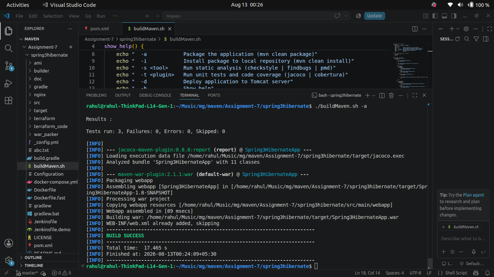

## 2. Installing to Local Repository (`-i`)

### Command:
```bash
./buildMaven.sh -i
```

### Mechanism & Location:
- Packages the application into a `.war` file.
- Copies the artifact into the user's local Maven cache directory (`~/.m2/ repository`).
- Stored Path:
  ```text
  ~/.m2/repository/Spring3HibernateApp/Spring3HibernateApp/1.8-SNAPSHOT/Spring3HibernateApp-1.8-SNAPSHOT.war
  ```

---

## Screenshots

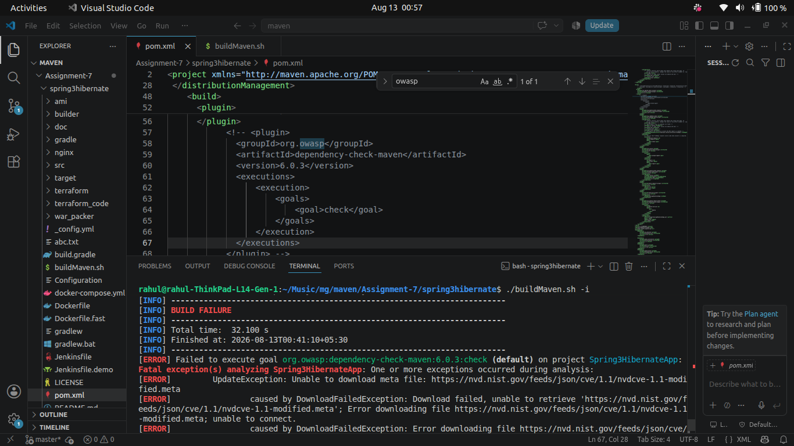
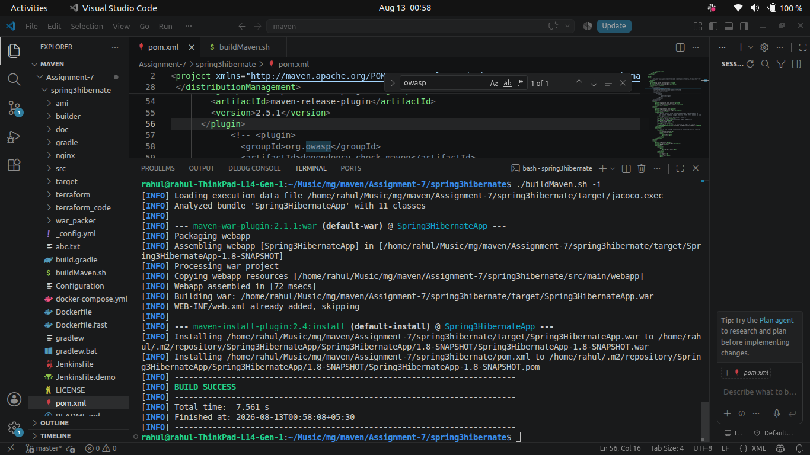
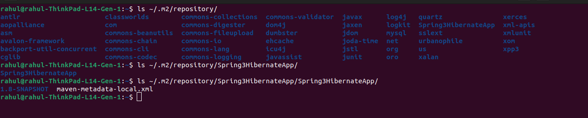

## 3. Static Code Analysis (`-s`)

### Commands:
```bash
./buildMaven.sh -s checkstyle
./buildMaven.sh -s findbugs
./buildMaven.sh -s pmd
```

### Analysis Details:
- **Checkstyle**: Scans codebase against code style and formatting standards (whitespace, imports, naming conventions).
- **FindBugs**: Inspects bytecode for potential runtime bugs, null pointer risks, and unclosed resources.
- **PMD**: Evaluates source code for structural bad practices, unused variables, empty catch blocks, and cyclomatic complexity.

---

## Screenshots

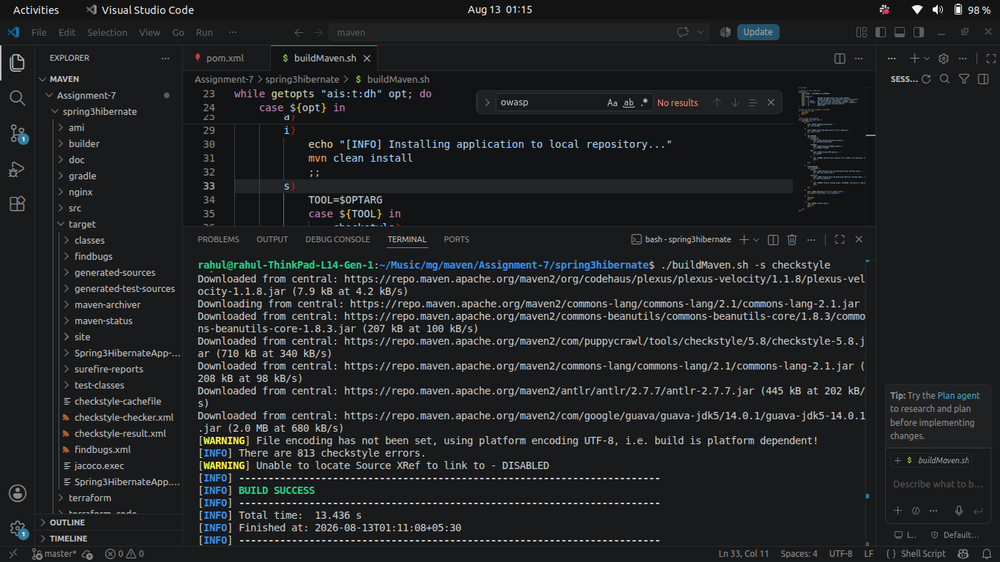
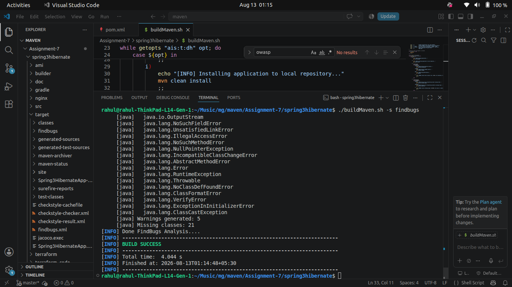
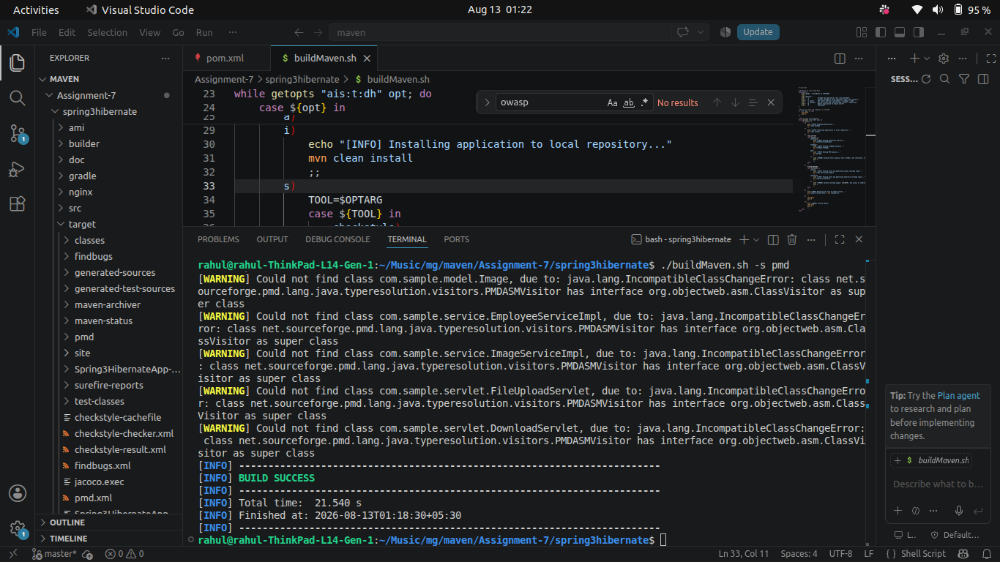
## 4. Unit Testing & Code Coverage (`-t`)

### Command:
```bash
./buildMaven.sh -t jacoco
```

### Mechanism:
- Attaches the JaCoCo Java agent during JUnit test execution.
- Measures branch and instruction execution coverage.
- Generates visual HTML reports at `target/site/jacoco/index.html`.

---

## Screenshots

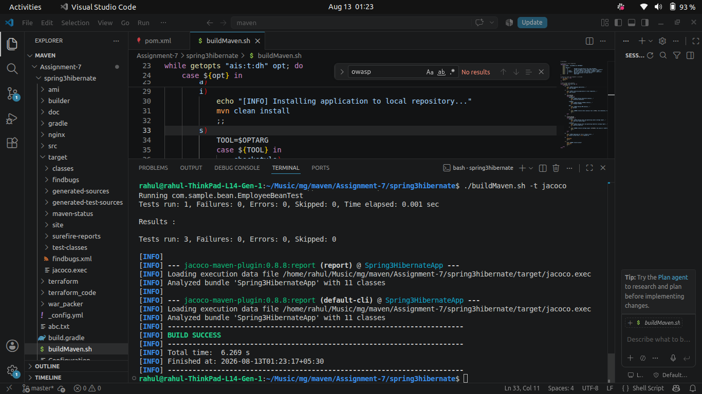

## 5. Application Deployment (`-d`)

### Command:
```bash
./buildMaven.sh -d
```

### Deployment Mechanism:
- Starts embedded Tomcat server on port `11011`.
- Deploys `Spring3HibernateApp.war`.
- Accessible via browser at: `http://localhost:11011/`

---

## Screenshots

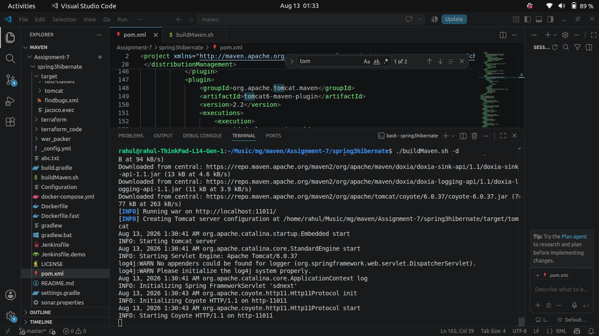
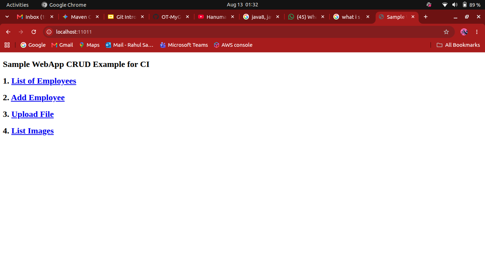

# Troubleshooting & Key Fixes

During pipeline validation, the following issue was encountered and resolved:

### OWASP Dependency Check Failure (NVD Feed Deprecation)
- **Symptom**: Running `./buildMaven.sh -i` failed with `UpdateException` / `403 Forbidden` attempting to fetch `https://nvd.nist.gov/feeds/json/cve/1.1/nvdcve-1.1-modified.meta`.
- **Root Cause**: NIST retired legacy JSON CVE feeds used by `dependency-check-maven:6.0.3`.
- **Resolution**: Commented out the unused `dependency-check-maven` plugin block in `pom.xml`, allowing local builds and installations to complete successfully without external feed dependencies.

---

[Screenshot 1](a7.3.png)

# Optional Enhancements & Quality Gates

To further strengthen CI/CD quality assurance, the build definition can be extended with documentation generation and threshold quality gates:

## 1. Automatic Documentation Generation
Add `maven-javadoc-plugin` to `pom.xml`:
```xml
<plugin>
    <groupId>org.apache.maven.plugins</groupId>
    <artifactId>maven-javadoc-plugin</artifactId>
    <version>3.3.1</version>
</plugin>
```
Run `mvn javadoc:javadoc` to generate HTML API docs under `target/site/apidocs/index.html`.

## Screenshots

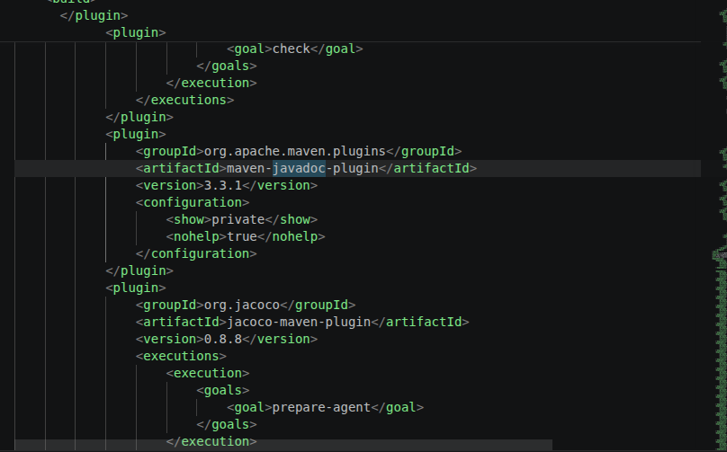

## 2. Enforcing Build Quality Gates
Configure build failures if quality checks do not meet minimum thresholds:

- **Checkstyle**: Set `<failOnViolation>true</failOnViolation>` and `<maxAllowedViolations>0</maxAllowedViolations>`.
- **FindBugs**: Set `<failOnError>true</failOnError>`.
- **PMD**: Set `<failOnViolation>true</failOnViolation>`.
- **JaCoCo Coverage Gate**: Add `check` goal rule requiring minimum instruction coverage (e.g., `<minimum>0.60</minimum>`).

---

## Screenshots

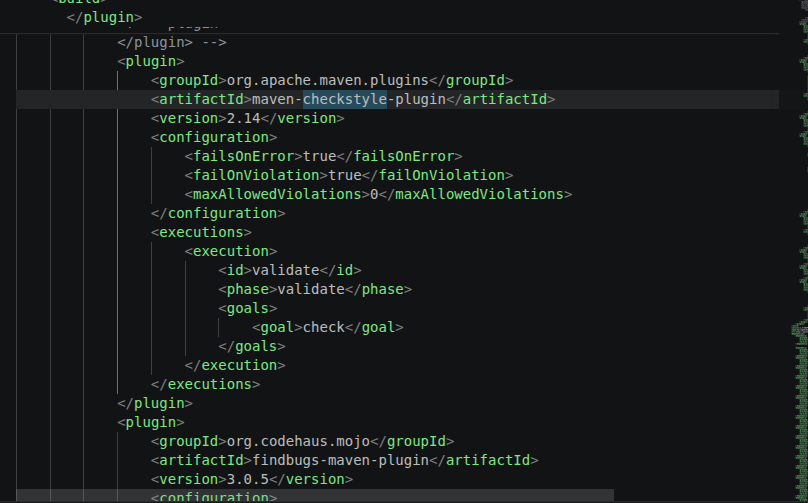
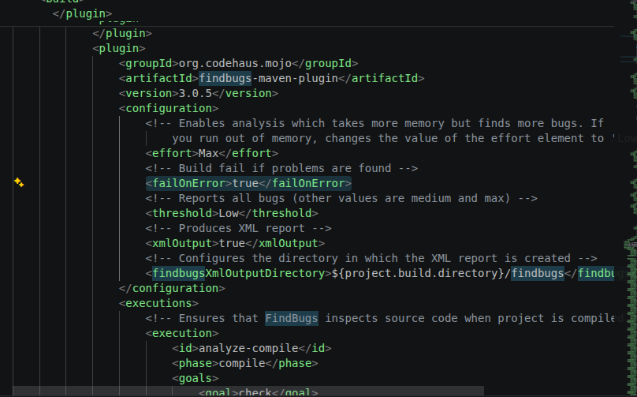
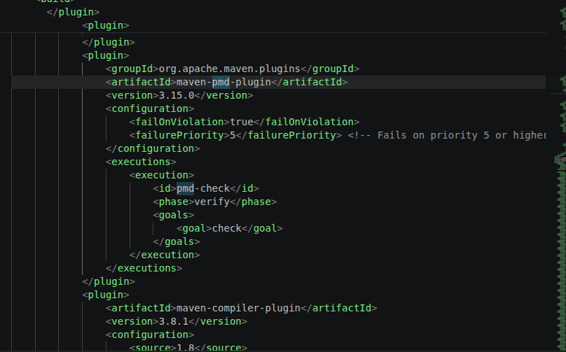
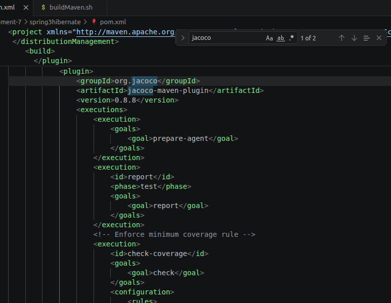
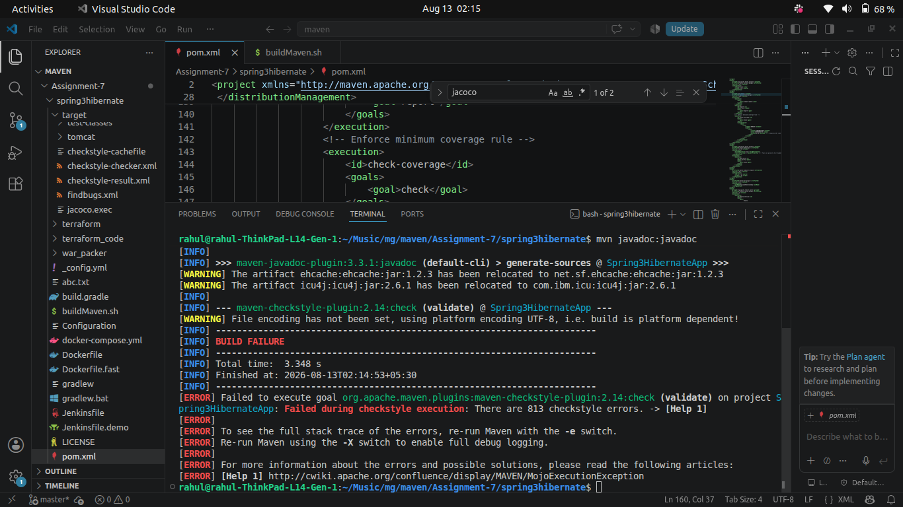

# Summary & Verification Checklist

- [x] Cloned project repository and verified Java 8 environment.
- [x] Configured `pom.xml` for Java 1.8 source/target compatibility.
- [x] Integrated PMD and JaCoCo coverage plugins.
- [x] Created, documented, and tested `buildMaven.sh` shell script.
- [x] Successfully executed `./buildMaven.sh -a` (Build Success).
- [x] Successfully executed `./buildMaven.sh -i` (Installed to `~/.m2`).
- [x] Successfully executed static analysis checks (`-s checkstyle`, `-s pmd`).
- [x] Verified deployment configuration on Tomcat port 11011 (`-d`).