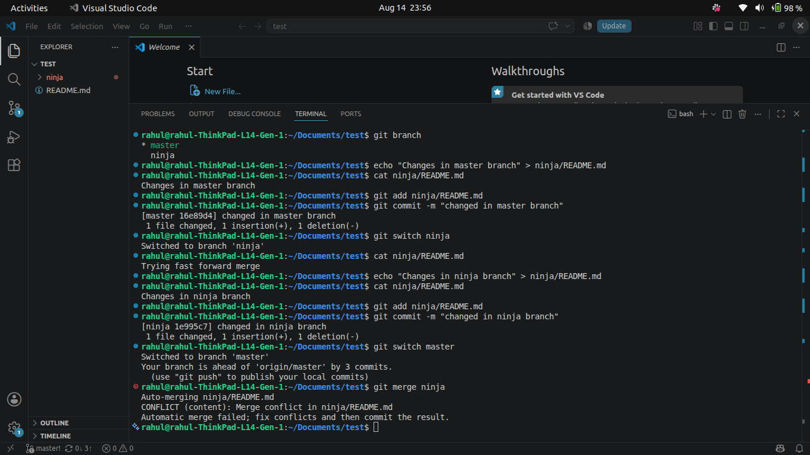
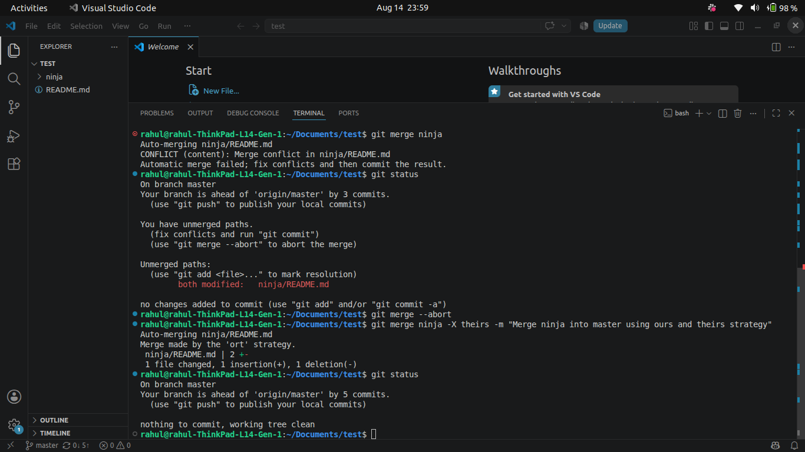
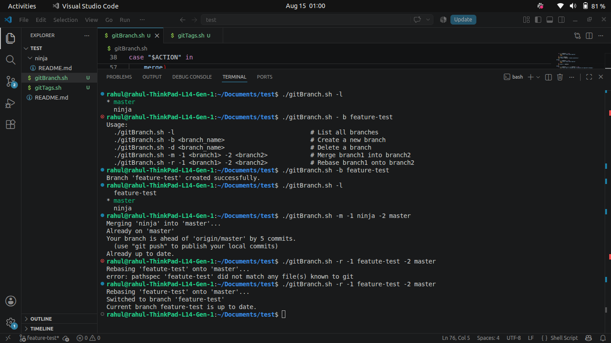
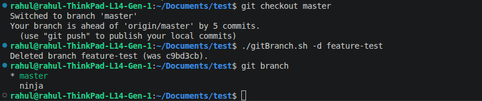
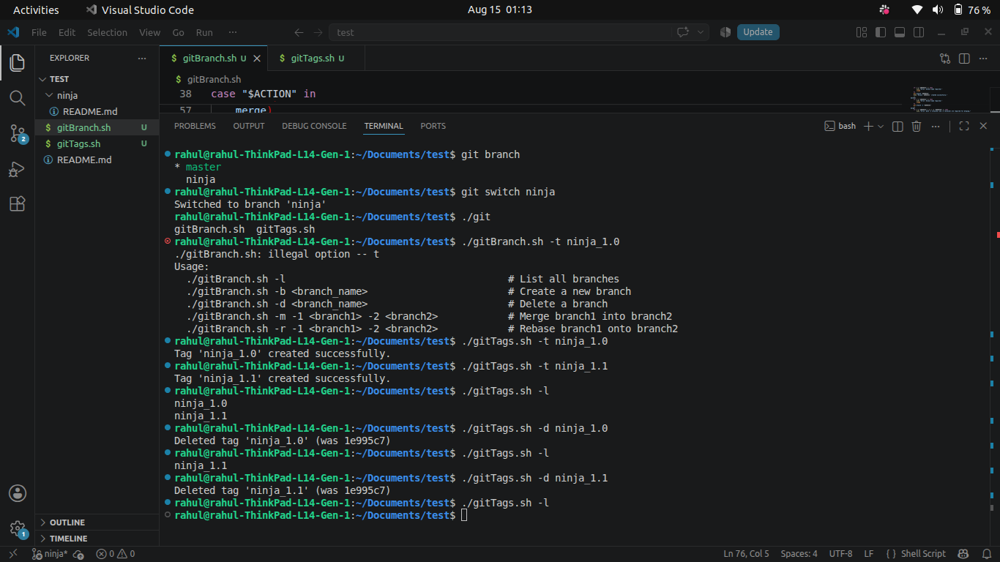
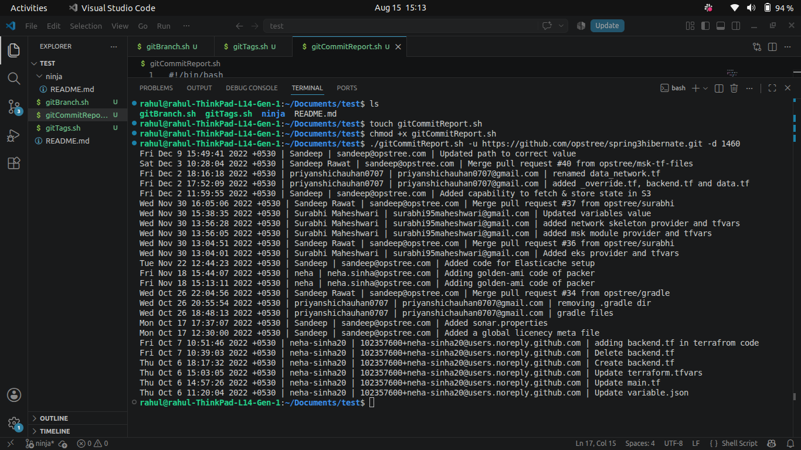

# Git Automation Suite & Commit Reporting CLI

This repository contains a lightweight, modular Bash automation suite designed for managing local Git workflows (branching, merging, rebasing, tag snapshots) and generating remote commit history reports. 

---

# Table of Contents

1. [Project Overview](#project-overview)
2. [Prerequisites & Environment](#prerequisites--environment)
3. [Part A: Core Branching, Merging & Rebasing Workflows](#part-a-core-branching-merging--rebasing-workflows)
4. [Part B: Automated Branch Management (`gitBranch.sh`)](#part-b-automated-branch-management-gitbranchsh)
5. [Part C: Automated Tag Management (`gitTags.sh`)](#part-c-automated-tag-management-gittagssh)
6. [Part D: Commit History Reporting (`gitCommitReport.sh`)](#part-d-commit-history-reporting-gitcommitreportsh)
7. [System Architecture & Workflow Diagram](#system-architecture--workflow-diagram)
8. [Summary & Verification Checklist](#summary--verification-checklist)

---

# Project Overview

The goal of this assignment is to design clean, dependency-free Bash scripts that automate common Git repository tasks and maintain strict adherence to project specifications. 

### Key Objectives:
- Demonstrate foundational branching, merging, and rebasing techniques (**Part A**).
- Build a positional CLI script to manage branch operations (**Part B**).
- Build a positional CLI script to create, list, and delete commit tags (**Part C**).
- Automate remote repository analysis to fetch commit history within a given day range (**Part D**).

---

# Prerequisites & Environment

Before executing the scripts, ensure your system satisfies the following requirements:

- **Operating System**: Linux / macOS / WSL (Windows Subsystem for Linux)
- **Shell Environment**: Bash 4.0+
- **Version Control**: Git 2.x+
- **Standard Utilities**: `git`, `chmod`, `mktemp`

Verify installation:
```bash
git --version   # Ensures Git is installed
bash --version  # Standard Bash shell
```

Make all scripts executable before running:
```bash
chmod +x gitBranch.sh gitTags.sh gitCommitReport.sh
```

---

# Part A: Core Branching, Merging & Rebasing Workflows

### The Task:
Demonstrate core Git operations locally by managing branches (`master` and `ninja`), performing branch creation, switching contexts, combining work using `merge`, and reorganizing commit history using `rebase`.

### How We Solved It:
We executed the core workflow steps directly using fundamental Git commands to establish baseline repository states:

1. **Branch Creation & Switch**:
   ```bash
   git checkout -b ninja
   ```
   *Created and switched to the `ninja` branch.*

2. **Branch Merging**:
   ```bash
   git checkout master
   git merge ninja
   ```
   *Merged the updates from `ninja` into `master`.*

3. **Branch Rebasing**:
   ```bash
   git checkout ninja
   git rebase master
   ```
   *Rebased `ninja` onto `master` to keep a linear commit history.*

---
## Screenshots




# Part B: Automated Branch Management (`gitBranch.sh`)

### The Task:
Write a clean Bash script (`gitBranch.sh`) that accepts positional parameters to list, create, delete, merge, and rebase branches.

### Supported Operations & Syntax:

| Operation | Command | Description |
|---|---|---|
| List Branches | `./gitBranch.sh -l` | Lists all local repository branches |
| Create Branch | `./gitBranch.sh -b <branch_name>` | Creates a new branch |
| Delete Branch | `./gitBranch.sh -d <branch_name>` | Deletes the specified branch |
| Merge Branches | `./gitBranch.sh -m -1 <branch1> -2 <branch2>` | Checks out `<branch2>` and merges `<branch1>` |
| Rebase Branch | `./gitBranch.sh -r -1 <branch1> -2 <branch2>` | Checks out `<branch1>` and rebases onto `<branch2>` |

## Screenshots




# Part C: Automated Tag Management (`gitTags.sh`)

### The Task:
Write a Bash script (`gitTags.sh`) to programmatically create, list, and delete Git tags (permanent snapshot markers attached to commits).

### Key Concept:
Tags in Git attach to **commits**, not branches. To tag a specific branch, switch context to that branch (`git checkout <branch>`) before creating the tag.

### Supported Operations & Syntax:

| Operation | Command | Description |
|---|---|---|
| Create Tag | `./gitTags.sh -t <tag_name>` | Tags the current `HEAD` commit |
| List Tags | `./gitTags.sh -l` | Lists all existing tags |
| Delete Tag | `./gitTags.sh -d <tag_name>` | Removes the specified tag |

### Execution Workflow:
```bash
# 1. Create tags
./gitTags.sh -t ninja_1.0
./gitTags.sh -t ninja_1.1

# 2. List tags
./gitTags.sh -l

# 3. Delete a tag
./gitTags.sh -d ninja_1.0

# 4. Confirm deletion
./gitTags.sh -l
```

## Screenshots



---

# Part D: Commit History Reporting (`gitCommitReport.sh`)

### The Task:
Develop a script (`gitCommitReport.sh`) that takes a remote repository URL (`-u`) and a number of days (`-d`), clones the repo into an isolated temporary folder, parses commit data for that timeframe, prints the formatted log, and cleans up the temporary directory.

### Command Usage:
```bash
./gitCommitReport.sh -u <repo_url> -d <days>
```

### Example Run:
```bash
./gitCommitReport.sh -u https://github.com/opstree/spring3hibernate.git -d 30
```

### Sample Output:
```text
Fri Dec 9 15:49:41 2022 +0530 | Sandeep | sandeep@opstree.com | Updated path to correct value
Sat Dec 3 10:28:04 2022 +0530 | Sandeep Rawat | sandeep@opstree.com | Merge pull request #40 from opstree/msk-tf-files
Fri Dec 2 18:16:18 2022 +0530 | priyanshichauhan0707 | priyanshichauhan0707@gmail.com | renamed data_network.tf
Fri Dec 2 17:52:09 2022 +0530 | priyanshichauhan0707 | priyanshichauhan0707@gmail.com | added _override.tf, backend.tf and data.tf
Fri Dec 2 11:59:55 2022 +0530 | Sandeep | sandeep@opstree.com | Added capability to fetch & store state in S3
```
## Screenshots



---

# Summary & Verification Checklist

- [x] **Part A**: Solved core branching, merging, and rebasing tasks using native Git commands.
- [x] **Part B**: Implemented and verified `gitBranch.sh` for branch listing, creation, deletion, merging, and rebasing.
- [x] **Part C**: Implemented and verified `gitTags.sh` for tag creation, listing, and deletion.
- [x] **Part D**: Implemented and verified `gitCommitReport.sh` for parsing commit logs over a specified day window.
- [x] Confirmed zero unnecessary dependencies and proper temporary directory cleanup.